# Using Kaggle

Kaggle offers free hosted notebooks (with GPUs), datasets, and competition environments. This guide focuses on how to use Kaggle efficiently for completing and submitting homeworks based on competitions.

---

## 1. Getting Started

- Create an account at [kaggle.com](https://www.kaggle.com)
- Complete your profile (phone verification needed for competitions and GPU access)
- Join the competition or class-specific homework link provided

---

## 2. Using Kaggle Notebooks

### Options:
- **Edit**: The notebook runs in Kaggle’s cloud environment
- **Save Only**: Saves your code, but doesn't execute it
- **Save & Run All (Required)**: Executes the notebook top-to-bottom and saves outputs

> To submit to a competition, the notebook must be saved after a full run. Saving alone is not enough.

Save Version

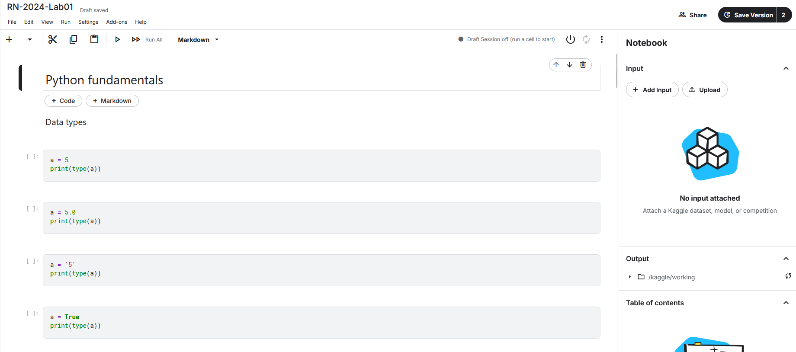

**Save & Run All**

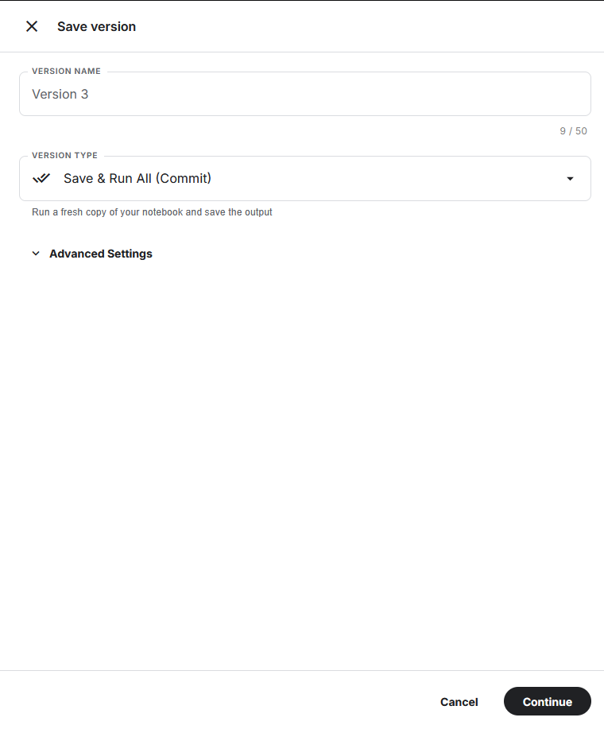

Give meaningful names

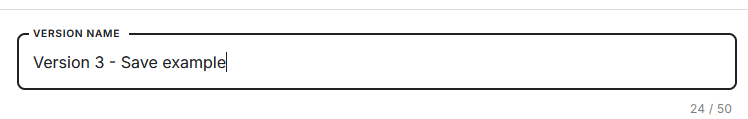
---

## 3. Submitting Homeworks (Competition Format)

Follow this workflow when working on a homework:

### Step 1: Open or create a Kaggle notebook

- Link it to the correct competition
- Attach necessary datasets via the sidebar

Linking the notebook to a competition

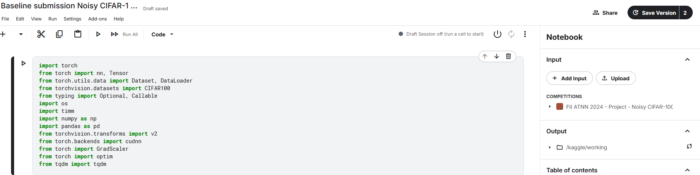

You can check the competition input and add additional datasets in the sidebar. 

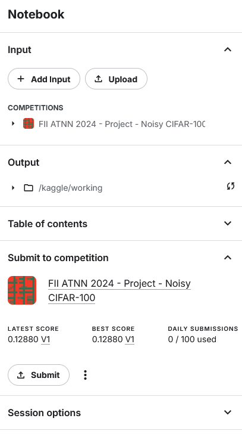

You can set up accelerator and pin to the original environment to avoid code-aging errors. 

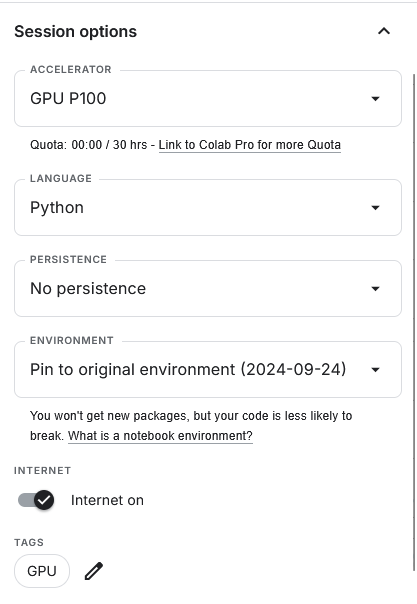

You can also access accelerator using the Settings tab

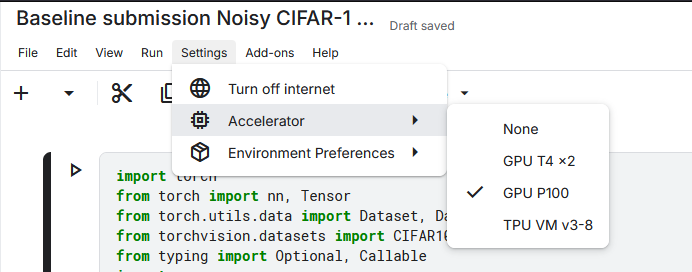

### Step 2: Implement your solution

- Import data from `/kaggle/input`
- Build and train your model
- Create a `/kaggle/working/submission.csv` file in the format required

```python
# Example: creating a submission file
submission = pd.DataFrame({'Id': test_ids, 'Prediction': predictions})
submission.to_csv('submission.csv', index=False)
```

### Step 3: Save & Run All

- Use **Save & Run All** to fully execute the notebook
- The submission file (`submission.csv`) must be generated during this run
- Outputs will be linked to a version

```
! Important: Only outputs from a run notebook can be submitted
Run the entire notebook before generating submission
Do not submit notebooks that haven’t been executed
```

> Tip: You can view past versions from the "Version" tab in the notebook editor

After a notebook has been saved and run, the submission.csv file is vizible in the **Output** section of the saved Notebook.

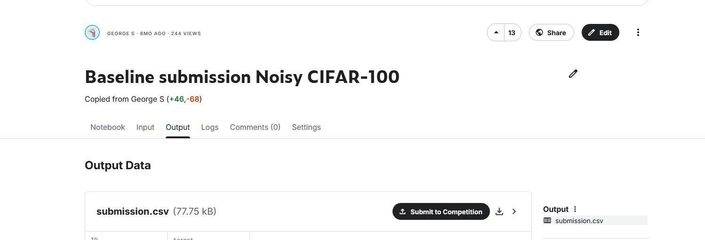

### Step 4: Submit to competition

Click **Submit to Competition**

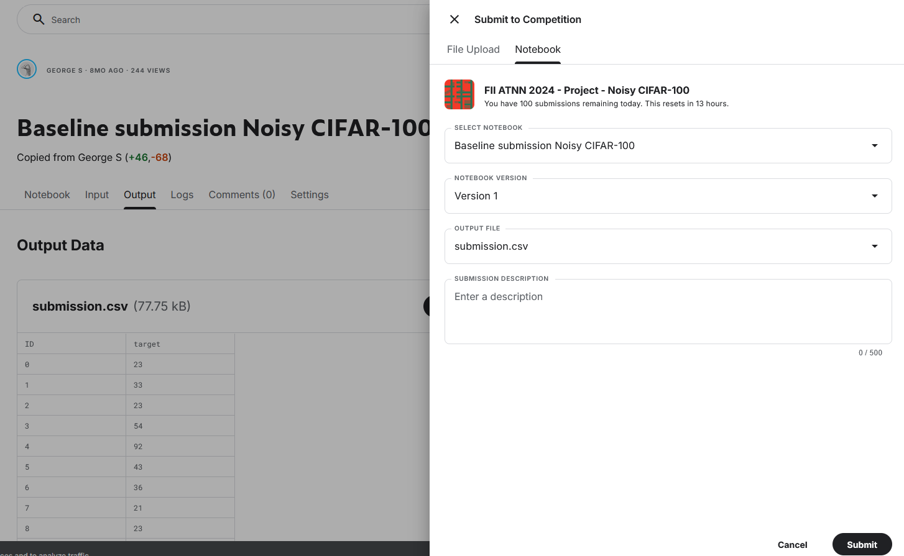

Select a Notebook and the version. Also add a submission description.

> Always name each version clearly

### Step 5: Share with the Reviewer

On the notebook page, click **Share**, select Private and share with people. 
If you select Public, your notebook will be visible to everyone. 
Share with the notebook with the teacher.

<!--  -->

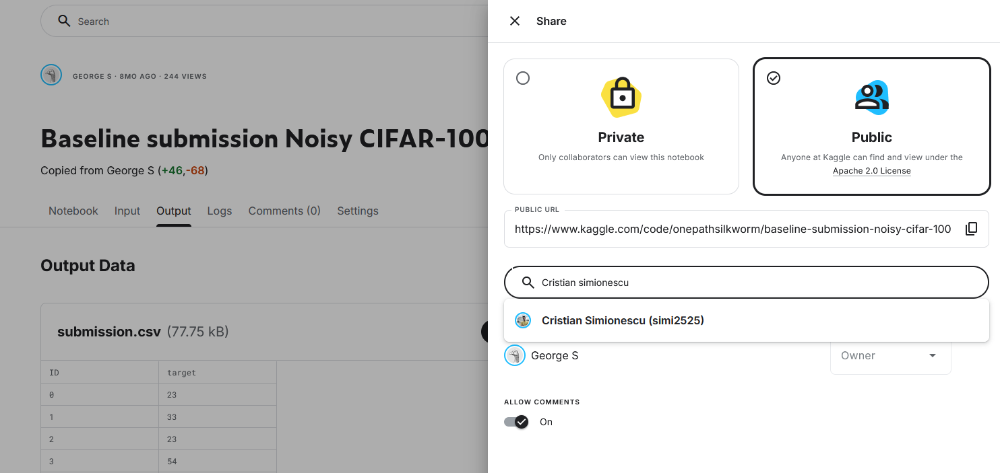


Remember: always share with the teacher and give appropriate permissions.

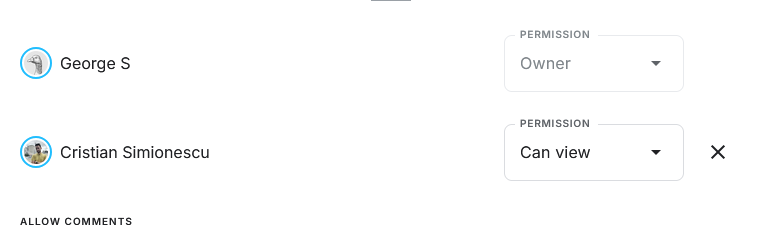


> Public notebooks are visible to everyone.

### Quick Checklist Before Submitting

- [x] Notebook is linked to the correct competition
- [x] Dataset is correctly loaded
- [x] `submission.csv` is generated in code
- [x] Used **Save & Run All**
- [x] Submission file is created and visible in output
- [x] Notebook version is named clearly
- [x] Correct version is selected for submission
- [x] Notebook is shared with the reviewer (`uaic-fii-rn`)

---

## Tips

- Name each saved version meaningfully
- Use GPU if your model requires it (enable under **Settings** > **Accelerator**)
- Kaggle provides 30 GPU hours/week
- **Save & Run All** consumes GPU time if a GPU accelerator is enabled
- Avoid wasting GPU quota on intermediate runs or debug sessions
- Keep enough GPU hours reserved for the final full run and submission


